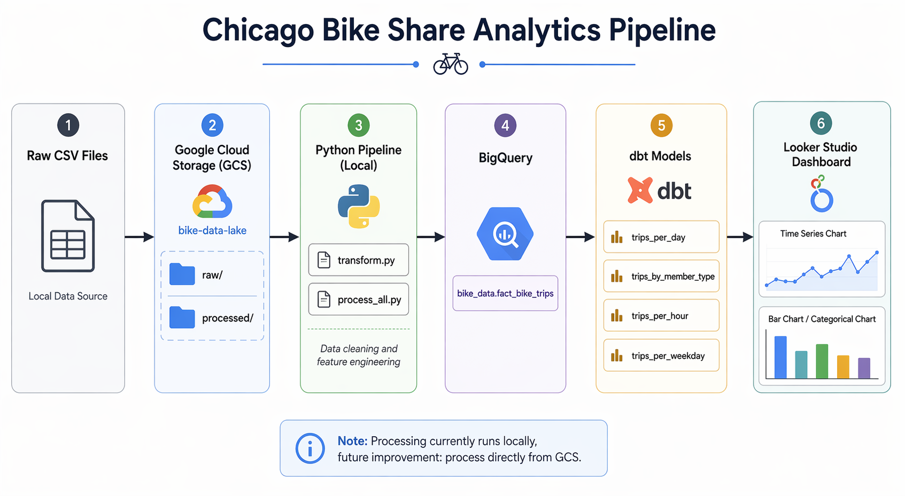
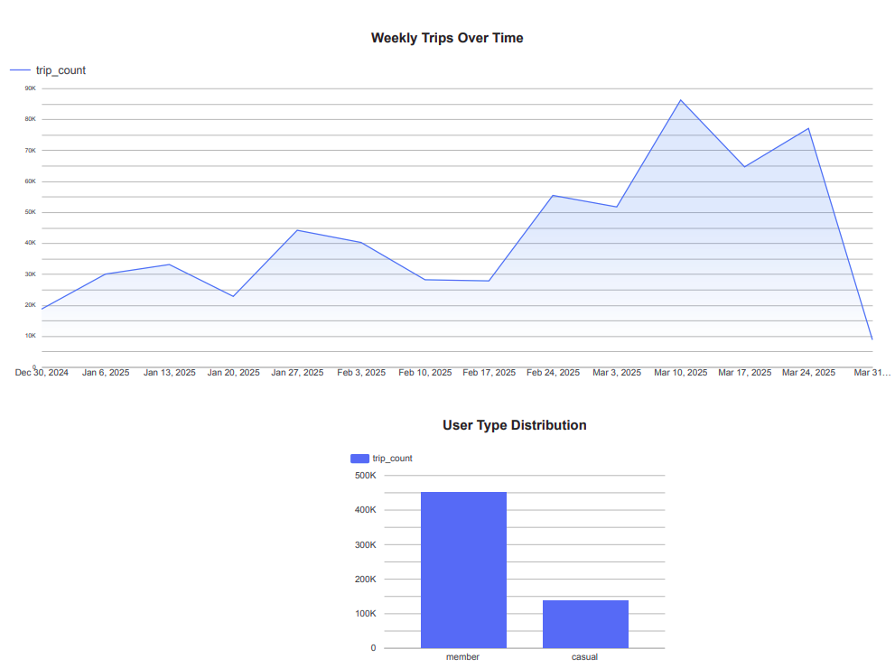
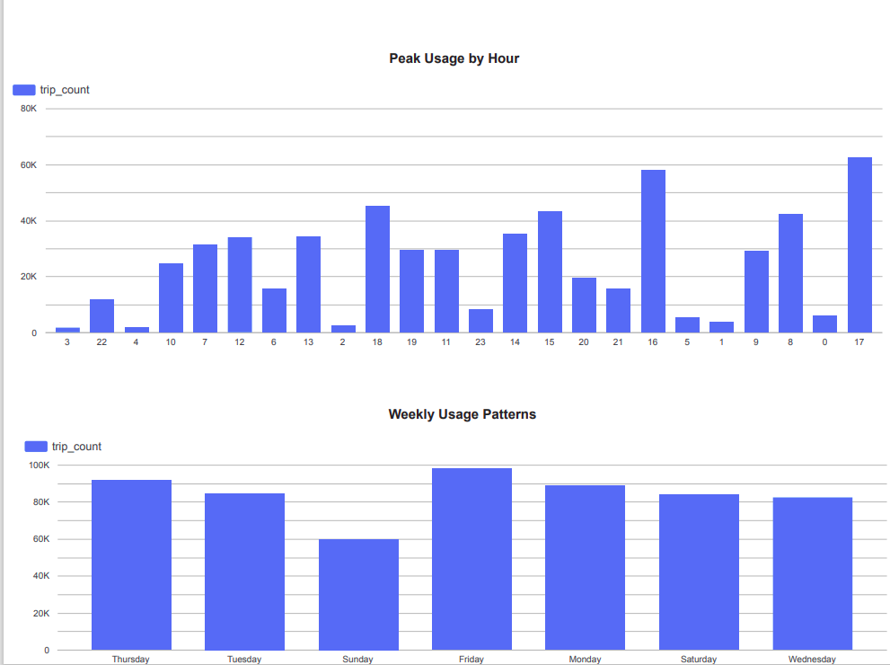

# 🚴‍♂️ Chicago Bike Share Analytics Pipeline

## 📌 Project Overview

This project builds an **end-to-end data engineering pipeline** to analyze bike-sharing trip data. The goal is to understand usage patterns over time and across user types using cloud-based data infrastructure and modern data tools.

The pipeline ingests raw trip data, stores it in a data lake, loads it into a data warehouse, transforms it into analytics-ready tables, and visualizes insights in dashboards.

---

## 🎯 Problem Statement

Bike-sharing systems generate large volumes of trip data. This project answers key questions such as:

* How does bike usage change over time?
* What are peak usage hours?
* How do casual users differ from members?
* What are weekly usage patterns?

---

## 🏗️ Architecture



### Pipeline Flow:

```
Local CSV Files
    ↓
Upload to GCS (Data Lake)
    ↓
Local Processing (Transform)
    ↓
Load to BigQuery (Data Warehouse)
    ↓
Transformations using dbt
    ↓
Visualization using Looker Studio
```

---

## 🧰 Technologies Used

* **Google Cloud Storage (GCS)** → Data Lake
* **BigQuery** → Data Warehouse
* **dbt** → Data Transformations
* **Terraform** → Infrastructure as Code (GCS bucket)
* **Docker** → Reproducibility
* **Looker Studio** → Dashboard Visualization
* **Python (Pandas)** → Data Processing

---

## 📂 Project Structure

```
chicago-bike-pipeline/
│
├── data/
│   ├── raw/                # Local raw CSV files
│   └── processed/          # Processed CSV files
│
├── scripts/
│   ├── process_all.py      # Orchestrates processing of all files
│   ├── run_pipeline.py     # Runs transform + load steps
│   ├── transform.py        # Cleans and transforms raw data
│   ├── upload_to_gcs.py    # Uploads raw data to GCS
│   └── load/
│       └── load_to_bigquery.py  # Loads processed data into BigQuery
│
├── dbt/
│   └── bike_analytics/
│       ├── models/         # dbt transformation models
│       ├── dbt_project.yml
│       └── ...
│
├── terraform/
│   ├── main.tf             # GCS bucket definition
│   ├── variables.tf
│   └── terraform.tfvars
│
├── report/
│   ├── dashboard1.png      # Time series + user distribution
│   ├── dashboard2.png      # Hour + weekday patterns
│   └── architecture_diagram.png
│
├── Dockerfile
└── README.md
```

---

## ⚙️ Data Pipeline

### 1. Data Ingestion

Raw CSV files are stored locally and uploaded to GCS using:

```
scripts/upload_to_gcs.py
```

---

### 2. Data Transformation (Local Processing)

Raw data is processed using:

```
scripts/transform.py
```

Transformations include:

* parsing timestamps
* calculating trip duration
* extracting:

  * date
  * hour
  * weekday
  * month

---

### 3. Load to BigQuery

Processed data is loaded into:

```
bike_data.fact_bike_trips
```

using:

```
scripts/load/load_to_bigquery.py
```

---

### 4. Data Transformation (dbt)

dbt builds analytics-ready models:

| Model                  | Description                   |
| ---------------------- | ----------------------------- |
| `trips_per_day`        | Daily trip counts             |
| `trips_by_member_type` | Member vs casual distribution |
| `trips_per_hour`       | Peak usage by hour            |
| `trips_per_weekday`    | Weekly usage patterns         |

These models are stored in:

```
bike_data_dbt
```

---

### 5. Visualization

Dashboards are built in Looker Studio using dbt models.

---

## 📊 Dashboards

### 📈 Dashboard 1



Contains:

* Daily Trips Over Time
* User Type Distribution

---

### 📊 Dashboard 2



Contains:

* Peak Usage by Hour
* Weekly Usage Patterns

---

## 🐳 Docker Usage

### Prerequisites

* Docker installed
* GCP credentials configured

---

### Build Image

```
docker build -t my-pipeline .
```

---

### Run Pipeline

```
docker run \
-v "$(pwd)/data:/usr/local/pipeline/data" \
-v "~/.config/gcloud/application_default_credentials.json:/usr/local/pipeline/credentials/application_default_credentials.json" \
-e GOOGLE_APPLICATION_CREDENTIALS="/usr/local/pipeline/credentials/application_default_credentials.json" \
-e GOOGLE_CLOUD_PROJECT="bike-analytics-project-492312" \
my-pipeline
```

---

## ☁️ Infrastructure (Terraform)

Terraform is used to define the GCS bucket:

```
terraform init
terraform plan
terraform apply
```

---

## ⚠️ Notes & Limitations

* Data is uploaded to GCS, but processing is currently performed locally.
* Future improvements:

  * process data directly from GCS
  * add workflow orchestration (e.g., Airflow)
  * implement incremental models in dbt

---

## 🚀 Future Improvements

* Full GCS → BigQuery pipeline (no local dependency)
* Airflow orchestration
* Data quality tests in dbt
* CI/CD pipeline

---

## ✅ Conclusion

This project demonstrates a complete data engineering workflow:

* Data Lake (GCS)
* Data Warehouse (BigQuery)
* Transformations (dbt)
* Visualization (Looker Studio)
* Reproducibility (Docker)
* Infrastructure as Code (Terraform)

---
